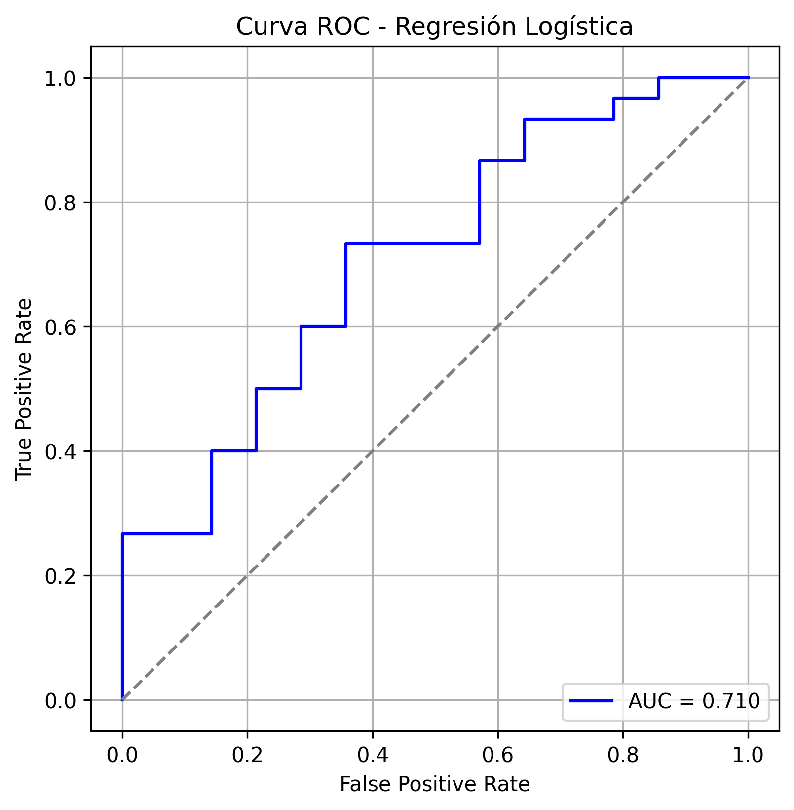
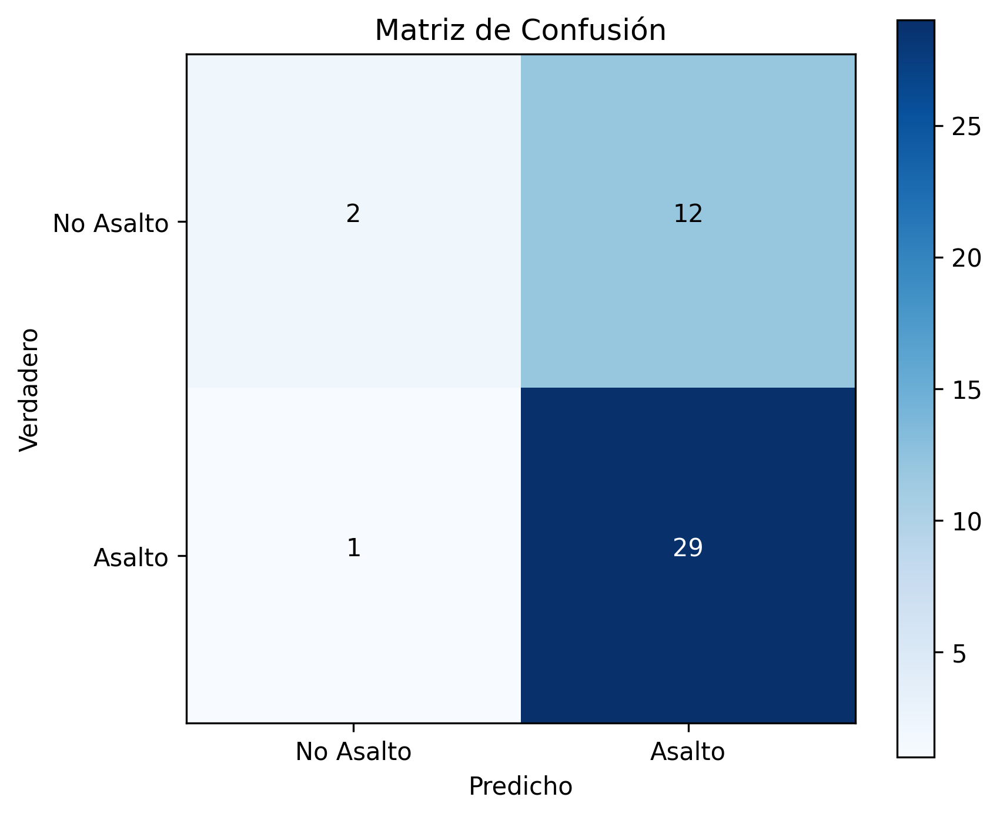
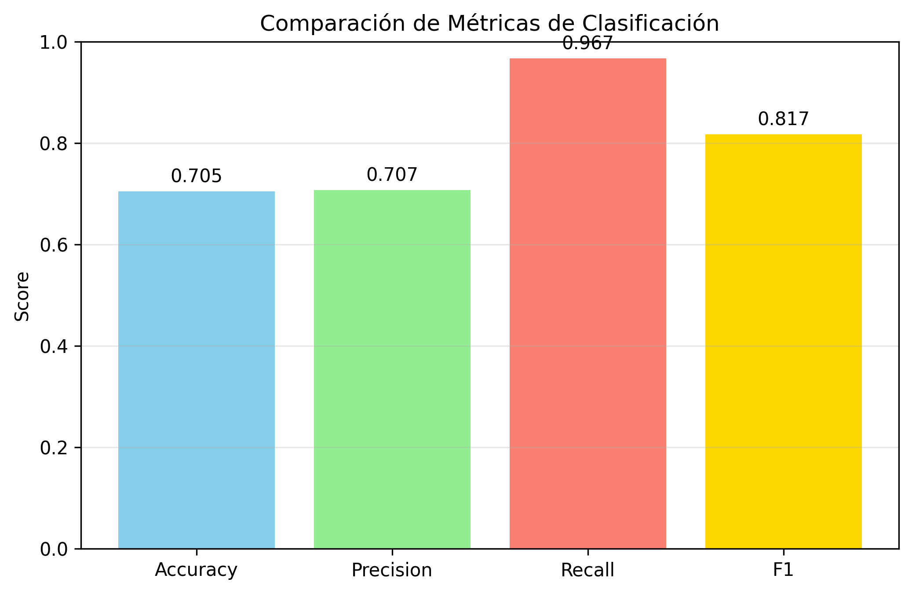
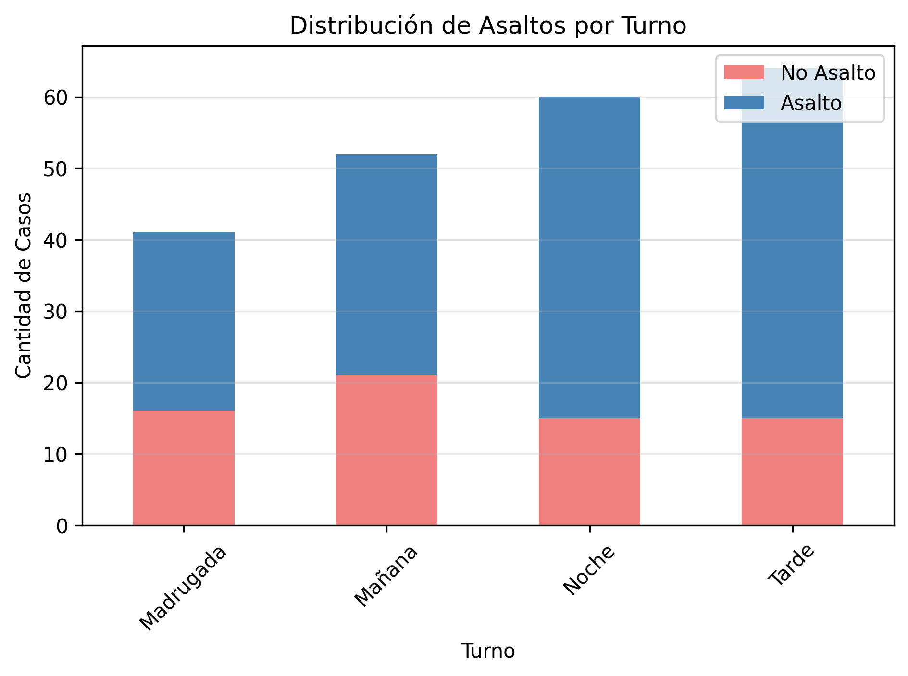

# Predicción de Asaltos por Colonia, Mes, Día y Turno

## Índice
- [Resumen Ejecutivo](#resumen-ejecutivo)
- [Arquitectura del Sistema](#arquitectura-del-sistema)
  - [Componentes Principales](#componentes-principales)
  - [Modelos Implementados](#modelos-implementados)
- [Resultados](#resultados)
- [Decisiones de Diseño](#decisiones-de-diseño)
  - [Selección de Modelos](#selección-de-modelos)
    - [Regresión Logística](#regresión-logística)
    - [Gradient Descent Manual](#gradient-descent-manual)
  - [Estrategia de Validación](#estrategia-de-validación)
  - [Procesamiento de Datos](#procesamiento-de-datos)
  - [Métricas de Evaluación](#métricas-de-evaluación)
- [Resultados](#resultados)
- [Instrucciones de Uso](#instrucciones-de-uso)

## Resumen Ejecutivo

Sistema que predice asaltos criminales con machine learning basado en colonia, mes, día y turno. Utiliza clasificación binaria y regresión para estimar probabilidad de ocurrencia y conteo de delitos.

## Arquitectura del Sistema

### Componentes Principales

- **`mejoresDatos.py`** - Motor de entrenamiento y evaluación de modelos
- **`appThinking.py`** - Interfaz web interactiva desarrollada en Streamlit
- **`delitos_legible.csv`** - Dataset histórico de incidentes criminales
- **`requirements.txt`** - Especificación de dependencias del proyecto

### Modelos Implementados

- **Clasificación Binaria**: Regresión Logística con optimización por GridSearchCV
- **Regresión**: Predicción de conteo de delitos utilizando técnicas de gradient descent

## Resultados

### Rendimiento del Modelo

**Clasificación Binaria (Regresión Logística)**:
- **Mejores Parámetros**: C=0.1, penalty=l2, solver=liblinear
- **F1 Score en CV**: 0.888
- **Accuracy**: 70.5%
- **Precision**: 70.7%
- **Recall**: 96.7%
- **F1 Score**: 81.7%

**Regresión (Gradient Descent Manual)**:
- **Mejores Hiperparámetros**: alpha=0.1, iteraciones=500
- **MSE en Test**: 0.0104
- **Convergencia**: Alcanzada exitosamente

### Interpretación

El modelo muestra **excelente sensibilidad** (96.7% recall) para detectar casos positivos de asalto, priorizando la identificación completa de situaciones de riesgo sobre la precisión absoluta. **Matriz de Confusión**: [TN=2, FP=12, FN=1, TP=29] indica que solo se pierde 1 asalto real de 30, mientras que genera 12 falsas alarmas de 14 casos negativos. Esta característica es deseable en aplicaciones de seguridad pública donde es preferible generar alertas falsas que perder casos reales de peligro.

La **convergencia exitosa** del gradient descent manual y el **bajo error cuadrático medio** en regresión indican que ambos enfoques capturan efectivamente los patrones espacio-temporales en los datos criminales.

### Visualizaciones Generadas

El sistema produce **4 gráficas analíticas**:

1. **Curva ROC** - Evaluación de capacidad discriminativa del modelo
   

2. **Matriz de Confusión** - Visualización de errores de clasificación
   

3. **Comparación de Métricas** - Gráfico de barras con accuracy, precision, recall, F1
   

4. **Distribución por Turno** - Patrones temporales de asaltos por período del día
   

## Decisiones de Diseño

### Selección de Modelos

Se seleccionaron dos enfoques complementarios para abordar el problema de predicción criminal desde perspectivas diferentes: clasificación binaria para determinar probabilidad de ocurrencia y regresión para estimar conteos específicos.

#### Regresión Logística

**Regresión Logística** se eligió como modelo principal por su interpretabilidad en problemas de seguridad pública, donde es crucial entender qué factores influyen en la predicción. Su naturaleza probabilística permite cuantificar la incertidumbre en las predicciones, aspecto fundamental para la toma de decisiones en prevención del delito.

#### Gradient Descent Manual

**Gradient Descent Manual** se implementó para demostrar comprensión profunda de los algoritmos de optimización y proporcionar control total sobre el proceso de entrenamiento, permitiendo ajustes específicos según las características del problema.

### Estrategia de Validación

Se utilizó **train/test split (80/20)** con **muestreo estratificado** para mantener la distribución de clases en conjuntos pequeños. **GridSearchCV** automatiza la búsqueda de hiperparámetros óptimos evaluando combinaciones de regularización (C: 0.01-10), tipos de penalización (L1/L2) y algoritmos de optimización (liblinear/saga).

### Procesamiento de Datos

**One-Hot Encoding** transforma variables categóricas (colonia, día, turno) en formato numérico. **Transformación trigonométrica** (seno/coseno) para meses captura la ciclicidad temporal. **Agregación por grupos** genera conteos de delitos por ubicación y período temporal.

### Métricas de Evaluación

**F1 Score** como métrica principal balancea precisión y recall, crítico en seguridad donde tanto falsos positivos como falsos negativos tienen consecuencias importantes. **ROC-AUC** evalúa capacidad discriminativa del modelo a través de diferentes umbrales de decisión.

## Instrucciones de Uso

### 1. Configuración del Ambiente
```bash
# Crear ambiente virtual
python3 -m venv .venv
source .venv/bin/activate

# Instalar dependencias
pip install -r requirements.txt
```

### 2. Entrenamiento de Modelos
```bash
python3 mejoresDatos.py
```

### 3. Despliegue de Aplicación Web
```bash
streamlit run appThinking.py
```

La aplicación estará disponible en `http://localhost:8501` y proporcionará una interfaz intuitiva para realizar predicciones en tiempo real seleccionando los parámetros de entrada correspondientes.